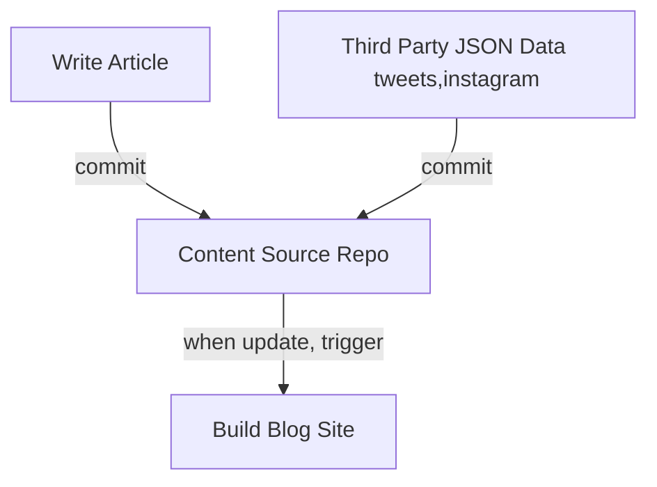

A long time ago I wanted to show all my works on my homepage, includes posts, tweets, instagram posts, etc. Today, I did it! By developing a new gatsby blog theme [gatsby-theme-timeline](https://github.com/theowenyoung/gatsby-theme-timeline). I'll record the workflow of my blog here.

## Workflow

The blog is content-site separated, which means I created a [content repository](https://github.com/theowenyoung/story)) and a [site repository](https://github.com/theowenyoung/theowenyoung.github.io). I supposed I can store all my creative works to [the content repo](https://github.com/theowenyoung/story)

I made a flow chart for the workflow:



## Language

My native language is Chinese, so I write Chinese posts, I have two twitter accounts to write tweets for [English tweets](https://twitter.com/TheOwenYoung) and [Chinese tweets](https://twitter.com/owenyoung_zh), the content repository's structure is like this:

```bash
/en
  instagram/
  tweets/
  posts/
/zh
  tweets/
  posts/
```

I created 2 menu links `/zh`,`/en` to let users to filter posts by language.


## Gatsby Config

Here is the [`gatsby-config.js`](https://github.com/theowenyoung/theowenyoung.github.io/blob/main/gatsby-config.js) for this blog:

```javascript
/**
 * Configure your Gatsby site with this file.
 *
 * See: https://www.gatsbyjs.com/docs/gatsby-config/
 */
const _ = require("lodash");
module.exports = {
  /* Your site config here */
  siteMetadata: {
    title: `Owen Young's Story`,
    siteUrl: `https://blog.owenyoung.com`,
    author: "Owen Young",
    description: "All my stories are here",
    keywords: ["Owen", "Owen Young", "Blog", "Story"],
    telegram: "@theowenyoung",
    menuLinks: [
      {
        name: "仅显示中文",
        url: "/zh",
      },
      {
        name: "Only English",
        url: "/en",
      },
    ],
    categories: [
      {
        name: "Post",
        url: "/tags/post",
      },
      {
        name: "Tweet",
        url: "/tags/tweet",
      },
      {
        name: "Instagram",
        url: "/tags/instagram",
      },
    ],
    social: [
      {
        name: "Github @theowenyoung",
        url: "https://github.com/theowenyoung",
      },
      {
        name: "RSS",
        url: "/rss.xml",
      },
      {
        name: "English RSS",
        url: "/en/rss.xml",
      },

      {
        name: "中文RSS",
        url: "/zh/rss.xml",
      },
      {
        name: "Twitter @TheOwenYoung",
        url: "https://twitter.com/TheOwenYoung",
      },
      {
        name: "中文Twitter @OwenYoung_zh",
        url: "https://twitter.com/OwenYoung_zh",
      },
      {
        name: "Instagram @iamowenyoung",
        url: "https://www.instagram.com/iamowenyoung/",
      },
      {
        name: "Source",
        url: "https://github.com/theowenyoung/story",
      },
      {
        name: "Site Source",
        url: "https://github.com/theowenyoung/theowenyoung.github.io",
      },
    ],
  },
  plugins: [
    {
      resolve: `@theowenyoung/gatsby-source-git`,
      options: {
        name: `content/posts`,
        remote: `https://github.com/theowenyoung/story.git`,
        branch: `main`,
        // Only import the docs folder from a codebase.
        patterns: ["en/**", "assets/**", "zh/**"],
      },
    },
    {
      resolve: `gatsby-transformer-json`,
      options: {
        typeName: ({ node }) => {
          const directorys = node.relativeDirectory.split(`/`);
          const locale = directorys[0];
          const rootDirectoryName = directorys[1];
          return _.upperFirst(
            _.camelCase(`${locale} ${rootDirectoryName} Json`)
          );
        },
      },
    },
    {
      resolve: `gatsby-plugin-mdx`,
      options: {
        extensions: [`.mdx`, `.md`],
        gatsbyRemarkPlugins: [
          {
            resolve: `gatsby-remark-images`,
            options: {
              maxWidth: 1024,
              linkImagesToOriginal: false,
            },
          },
          { resolve: `gatsby-remark-copy-linked-files` },
          { resolve: `gatsby-remark-smartypants` },
          {
            resolve: "gatsby-remark-mermaid",
            options: {
              viewport: {
                width: 768,
                height: 800,
              },
            },
          },
        ],
        remarkPlugins: [
          require(`remark-slug`),
          require(`remark-emoji`),
          require(`remark-toc`),
        ],
      },
    },
    {
      resolve: `gatsby-theme-timeline`,
      options: {
        mdxOtherwiseConfigured: true,
        shouldTransformJson: false,
        tweetTypeName: ["EnTweetsJson", "ZhTweetsJson"],
        instagramTypeName: ["EnInstagramJson", "ZhInstagramJson"],
        utterances: {
          repo: "theowenyoung/story",
          label: "comment",
        },
      },
    },
    {
      resolve: `gatsby-plugin-manifest`,
      options: {
        name: `Owen Young's Story`,
        short_name: `Owen`,
        start_url: `/`,
        background_color: `#f7f0eb`,
        theme_color: `#FF4500`,
        display: `standalone`,
        icon: `src/images/icon.png`,
      },
    },
    {
      resolve: `gatsby-plugin-feed`,
      options: {
        feeds: ["", "en", "zh"].map((locale) => {
          return {
            serialize: ({ query: { site, allBlogPost } }) => {
              return allBlogPost.nodes
                .filter((node) => {
                  if (locale === "") {
                    return true;
                  } else {
                    return node.tags.includes(locale);
                  }
                })
                .map((node) => {
                  let html = node.body;
                  if (node.__typename === "MdxBlogPost") {
                    html = node.parent.html;
                  }
                  return Object.assign(
                    {},
                    {
                      title: node.title,
                      description: node.excerpt,
                      date: node.dateISO,
                      url: site.siteMetadata.siteUrl + node.slug,
                      guid: site.siteMetadata.siteUrl + node.slug,
                      custom_elements: [{ "content:encoded": html }],
                    }
                  );
                });
            },
            query: `
            {
              allBlogPost(limit: 25, sort: {fields: [date, slug], order: DESC}) {
                nodes {
                  id
                  __typename
                  excerpt
                  slug
                  title
                  body
                  tags
                  dateISO: date
                  ... on MdxBlogPost {
                    id
                    parent {
                      ... on Mdx {
                        id
                        html
                        parent {
                          ... on File {
                            id
                            name
                            sourceInstanceName
                          }
                        }
                      }
                    }
                  }
                  ... on SocialMediaPost {
                    id
                    parent {
                      __typename
                    }
                  }
                }
              }
            }
            `,
            output: `/${locale ? locale + "/" : ""}rss.xml`,
          };
        }),
      },
    },
    {
      resolve: `gatsby-plugin-sitemap`,
    },
    {
      resolve: `gatsby-plugin-google-gtag`,
      options: {
        // You can add multiple tracking ids and a pageview event will be fired for all of them.
        trackingIds: [
          "G-FS0E2RE694", // Google Analytics / GA
        ],
      },
    },
  ],
};
```
